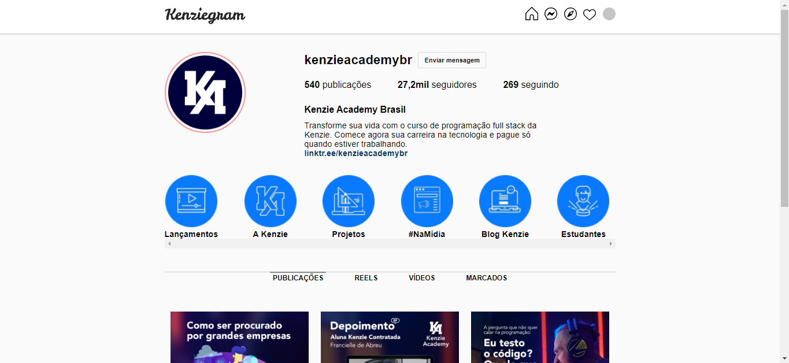

<h1 align="center"> Projeto Dev - Kenziegram </h1>

Kenziegram é um clone da interface do Instagram.  

  <a href="#-tecnologias">Tecnologias</a>&nbsp;&nbsp;&nbsp;|&nbsp;&nbsp;&nbsp;
  <a href="#-projeto">Projeto</a>&nbsp;&nbsp;&nbsp;|&nbsp;&nbsp;&nbsp;

 

  

## 🚀 Tecnologias

Esse projeto foi desenvolvido com as seguintes tecnologias:

- HTML e CSS
- Git e Github

## 💻 Projeto

Projeto criado para clonar a interface da rede social "Instagram" com intuito de aprender sobre as tecnologias HTML e CSS.

- [Visite o projeto online](https://micaelsantiago.github.io/ProjetoDev-Kenziegram/)

## 🤝 Colaborador(es)

<table>
  <tr>
    <td align="center">
      <a href="http://github.com/micaelsantiago">
         
        
          <b>micaelsantiago</b>
        
      </a>
    </td>
  </tr>
</table>

## :dart: Status do projeto
* Concluído! / Concluded! :ballot_box_with_check: